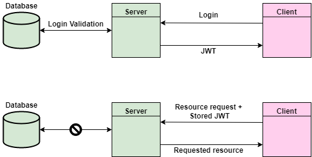

# Simple JWT Guide for ASP.NET

## What is a JWT?

JWT stands for JSON Web Token, which essentially is a token that does not require a database to be validated. A signed JWT is comprised of three parts:

1. Header encoded in Base64
2. Payload encoded in Base64
3. A hashed signature (Header+Payload+Secret Key)

The header common describes the algorithm and type, while the payload is the interesting part. The payload is where we can find claims in the form of a JSON key value pair. Lastly, the signature is simply a hash of the header and payload along with a secret key 🔑

```
Header: {
  "alg": "HS256",
  "typ": "JWT"
}

Payload: {
  "FirstName": "Obama",
  "LastName": "ObamasLastName",
  "Expires": "Wed April 01 2022 13:30:00 GMT+0200",
  "Hotel": "Trivago"
}

Signature: Hash(
        Base64UrlEncode(Header) + "." +
        Base64UrlEncode(Payload),
        SecretKey
        )

Header in Base64 👉 eyJhbGciOiJIUzI1NiIsInR5cCI6IkpXVCJ9.
Payload in Base64 👉 eyJGaXJzdE5hbWUiOiJPYmFtYSIsIkxhc3ROYW1lIjoiT2JhbWFzTGFzdE5hbWUiLCJFeHBpcmVzIjoiV2VkIEFwcmlsIDAxIDIwMjIgMTM6MzA6MDAgR01UKzAyMDAiLCJIb3RlbCI6IlRyaXZhZ28ifQ.
Hash(HS256) of Header + Payload + Secret Key 👉 42oWgS45G6zM0KxVyUbhqdXWIEwHdgCY5OodoFg-kpY
```

> **Complete JWT
> <span style="color:purple">eyJhbGciOiJIUzI1NiIsInR5cCI6IkpXVCJ9</span>.<span style="color:green">eyJGaXJzdE5hbWUiOiJPYmFtYSIsIkxhc3ROYW1lIjoiT2JhbWFzTGFzdE5hbWUiLCJFeHBpcmVzIjoiV2VkIEFwcmlsIDAxIDIwMjIgMTM6MzA6MDAgR01UKzAyMDAiLCJIb3RlbCI6IlRyaXZhZ28ifQ</span>.<span style="color:brown">42oWgS45G6zM0KxVyUbhqdXWIEwHdgCY5OodoFg-kpY</span>**

**Notice: The JWT payload is only base64 encoded, so anyone can decode and read the data. Choose what data to share carefully**

### How is JWT handled?

The JWT is created and signed once the clients provided us with a correct username and password and is sent back to the client in the response. The token can now be stored by the client for future requests. The safest storage would be in-memory, but that doesn't persist, so sessionStorage along with fingerprints is the commonly used storage.



#### Read more & Tools

- [Jwt.io](https://jwt.io/) - Allows you to decode, verify and generate JWT.
- [RFC7519](https://datatracker.ietf.org/doc/html/rfc7519) - Essentially the specification for JWT.
- [Stackoverflow](https://stackoverflow.com/questions/27301557/if-you-can-decode-jwt-how-are-they-secure) - If you can decode JWT, how are they secure?
- [Zalando Engineering](https://engineering.zalando.com/posts/2017/07/the-purpose-of-jwt-stateless-authentication.html) - The Purpose of JWT: Stateless Authentication
- [Owasp](https://cheatsheetseries.owasp.org/cheatsheets/JSON_Web_Token_for_Java_Cheat_Sheet.html#token-storage-on-client-side) - Token Storage on Client Side

## How do I implement JWT into my ASP.NET Application?

### Creating, serializing and validating the token

There is a package that is especially interesting called _System.IdentityModel.Tokens.Jwt_. The package provides the necessary tooling to create, serialize and validate tokens.

```
// Serializing and creating a token

public string CreateToken(User user)
        {
            var claims = new List<Claim>
            {
            new Claim(JwtRegisteredClaimNames.Sub, user.Id.ToString()),
            new Claim(ClaimTypes.Name, String.Concat(user.FirstName, " ", user.LastName)),
            new Claim(ClaimTypes.Email, user.Email)
            };


            var securityTokenDescriptor = new SecurityTokenDescriptor
            {
                Subject = new ClaimsIdentity(claims.ToArray()),
                Expires = DateTime.UtcNow.AddMinutes(1),
                Issuer = "Ex -> http://localhost:8000/ (The  issuer of the token, optional)",
                Audience = "Ex -> http://localhost:8001/ (The audience aka recipient of the token, optional)",
                SigningCredentials = new SigningCredentials(
                new SymmetricSecurityKey(Encoding.ASCII.GetBytes("SecretKey")),
                SecurityAlgorithms.HmacSha256Signature),
            };

            var securityTokenHandler = new JwtSecurityTokenHandler();
            var token = securityTokenHandler.CreateToken(securityTokenDescriptor);
            return securityTokenHandler.WriteToken(token);
        }

```

```
// Manually Validating a token

public bool ValidateToken(string token)
        {
            var tokenValidationParams = new TokenValidationParameters
            {
                ValidateIssuerSigningKey = true,
                IssuerSigningKey = new SymmetricSecurityKey(Encoding.ASCII.GetBytes("SecretKey")),
                // As stated before Issuer and Audience params are optional
                ValidateIssuer = false,
                ValidateAudience = false,
                // To deal with time variations between the client and server. Default value = 300 sec.
                ClockSkew = TimeSpan.Zero,
            };


            var securityTokenHandler = new JwtSecurityTokenHandler();

            try
            {
                securityTokenHandler.ValidateToken(token, tokenValidationParams, out SecurityToken validatedToken);
                return true;
            }
            catch (Exception)
            {
                return false;
            }
        }

    }
```

These methods can be provided as a service for the application. Keep in mind that we can automatically authenticate JWT by providing an authentication handler to the framework's provided middleware.

- [Stackoverflow](https://stackoverflow.com/questions/50012155/jwt-claim-names) - ClaimTypes v JwtRegisteredClaimNames
- [RFC7519 Sec. 4](https://datatracker.ietf.org/doc/html/rfc7519#section-4) - Issuer and Audience

### Automatically Authenticating JWT

To automatically authenticate JWT, we require an authentication handler to make use of the JWT that has been issued to clients. Thankfully, we can use the package _Microsoft.AspNetCore.Authentication.JwtBearer_ for this purpose. By chaining AddJwtBearer onto the authenticationBuilder, we are providing the middleware with the tooling required to authenticate the JWT.

```
builder.Services.AddAuthentication((opt) =>
{
    opt.DefaultAuthenticateScheme = JwtBearerDefaults.AuthenticationScheme;
    opt.DefaultChallengeScheme = JwtBearerDefaults.AuthenticationScheme;
})
    .AddJwtBearer((opt) =>
{
    opt.TokenValidationParameters = new TokenValidationParameters
    {
        ValidateIssuerSigningKey = true,
        IssuerSigningKey = new SymmetricSecurityKey(Encoding.ASCII.GetBytes("TheKeyRequiresAtLeast128bits")),
        ValidateIssuer = false,
        ValidateAudience = false,
        ClockSkew = TimeSpan.Zero,
    };
});
```

- [Stackoverflow](https://stackoverflow.com/questions/48836688/what-exactly-is-useauthentication-for) - What exactly is UseAuthentication for?
- [joonasw.net](https://joonasw.net/view/creating-auth-scheme-in-aspnet-core-2) - Creating an authentication scheme in ASP.NET Core 2.0 (In depth about schemes and handlers)

### Swagger 😎

As I mentioned before, the JWT is something that is stored by the client and sent along with each request. If you are using Swagger, you might want to add the code below to store and use the token in the correct manner. The code not only adds an interface for you to save the token but also adds it to the header for future HTTP requests.

> Don't forget to add "Bearer" before the token.

```
builder.Services.AddSwaggerGen(opt =>
{
    opt.AddSecurityDefinition("Bearer", new OpenApiSecurityScheme
    {
        In = ParameterLocation.Header,
        Description = "Please insert JWT into the field :)",
        Name = "Authorization",
        Type = SecuritySchemeType.ApiKey,
    });
    opt.AddSecurityRequirement(new OpenApiSecurityRequirement {
    {
        new OpenApiSecurityScheme
        {
            Reference = new OpenApiReference
            {
                Type = ReferenceType.SecurityScheme,
                Id = "Bearer"
            }
        },
        new string[] { }
        }
    });
});
```

- [Stackoverflow](https://stackoverflow.com/questions/58179180/jwt-authentication-and-swagger-with-net-core-3-0) - Adding a Authorization header for swagger
